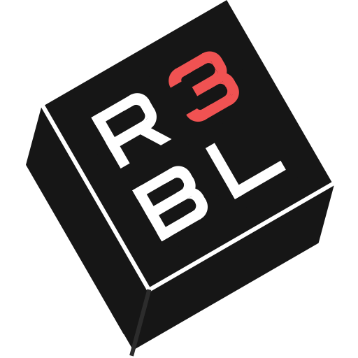

# R3BL VSCode Extensions

A monorepo containing all R3BL VSCode extensions.

<!-- START doctoc generated TOC please keep comment here to allow auto update -->
<!-- DON'T EDIT THIS SECTION, INSTEAD RE-RUN doctoc TO UPDATE -->

- [Extensions](#extensions)
  - [R3BL Extension Pack (Recommended)](#r3bl-extension-pack-recommended)
  - [Individual Extensions](#individual-extensions)
    - [R3BL Theme](#r3bl-theme)
    - [R3BL Auto Insert Copyright](#r3bl-auto-insert-copyright)
    - [R3BL Semantic Configuration](#r3bl-semantic-configuration)
    - [R3BL Task Management](#r3bl-task-management)
    - [R3BL Copy Selection Path and Range](#r3bl-copy-selection-path-and-range)
- [Installation](#installation)
  - [Quick Start (Recommended)](#quick-start-recommended)
  - [Using Prebuilt Extensions](#using-prebuilt-extensions)
  - [Build and Install](#build-and-install)
  - [Manual Installation](#manual-installation)
- [Usage](#usage)
  - [Getting Started](#getting-started)
- [Development](#development)
  - [Setup](#setup)
  - [Workflow](#workflow)
    - [Modifying Existing Extensions](#modifying-existing-extensions)
    - [Creating New Extensions](#creating-new-extensions)
  - [Building](#building)
  - [Packaging](#packaging)
  - [For Maintainers](#for-maintainers)
  - [Testing](#testing)
  - [Linting](#linting)
- [Structure](#structure)
- [Publishing](#publishing)
- [License](#license)

<!-- END doctoc generated TOC please keep comment here to allow auto update -->

## Extensions

### R3BL Extension Pack (Recommended)



**The complete R3BL development experience in one package!** This extension pack includes:

- **R3BL Theme** - Custom dark theme optimized for Rust and Markdown
- **R3BL Auto Insert Copyright** - Automatic copyright header insertion
- **R3BL Semantic Configuration** - Enhanced Rust syntax highlighting (automatic)
- **R3BL Task Management** - Manage task spaces and organize open tabs
- **R3BL Copy Selection Path and Range** - Copy file paths with line ranges (Claude Code compatible)
- **rust-analyzer** - Official Rust language server

**What you get:**

- ✅ Beautiful, carefully crafted dark theme
- ✅ Automatic copyright headers for new files
- ✅ Enhanced semantic highlighting for Rust (applied automatically)
- ✅ Task space management for context switching (keyboard shortcut: Alt+Shift+T)
- ✅ Quick file path copying with selection ranges (keyboard shortcut: Alt+o)
- ✅ Full Rust language support via rust-analyzer
- ✅ Zero manual configuration required

### Individual Extensions

If you prefer to install extensions individually:

#### R3BL Theme

A custom VSCode theme designed for Rust and Markdown with R3BL styling. Features a
carefully crafted dark theme optimized for code readability and visual appeal.

**Usage:**

- Go to `File > Preferences > Color Theme` (or `Ctrl+K Ctrl+T`)
- Select "R3BL Theme" from the list

#### R3BL Auto Insert Copyright

Automatically includes copyright and license headers in your source code files. This
extension saves time and cognitive energy by automating the process of adding copyright
notices to new files.

**Features:**

- Automatically adds copyright notices to new files upon opening
- Supports multiple license types (MIT, Apache 2.0, Apache 2.0 One Line, GPL 3.0, or none)
- Manual command available: `Prepend Copyright`
- Configurable for specific file types
- Works right out of the box with sensible defaults

**Supported Languages:** C, C++, C#, CSS, Go, Java, JavaScript, Objective-C, Rust, SCSS,
Swift, TypeScript, TypeScript React, Vue

**Configuration:**

- `copyrighter.author`: Set the copyright holder name
- `copyrighter.license`: Choose license type (none, Apache2, Apache2OneLine, MIT, GPL3)
- `copyrighter.note`: Optional additional note
- `copyrighter.newFilesOnly`: Only inject copyright in new files

Example VSCode settings:

```json
{
  "copyrighter.author": "Your Name",
  "copyrighter.license": "MIT"
}
```

#### R3BL Semantic Configuration

Automatically applies enhanced semantic highlighting settings for Rust development. This
extension:

- Detects when R3BL Theme is active
- Offers to apply semantic highlighting automatically
- Provides commands to enable/disable enhanced highlighting
- Works seamlessly with rust-analyzer

#### R3BL Task Management

Manage task spaces - collections of open tabs for different work contexts. Inspired by the
IntelliJ Task Management plugin, this extension helps you organize your work by switching
between different collections of open tabs.

**Features:**

- **Quick Access**: `Alt+Shift+T` brings up task management dialog
- **Task Spaces**: Collections of open editor tabs that can be saved and restored
- **Context Switching**: Seamlessly switch between task spaces (closes current tabs, opens new ones)
- **Auto-Save**: Tabs are automatically saved when opened/closed/moved within a task space
- **Status Bar Indicator**: Always know which task space you're currently in
- **Task File Association**: Optionally link a `task/*.md` file that's always open in that task space
- **Full Management**: Create, switch to, rename, and delete task spaces from the same interface
- **Workspace-Specific**: Task spaces stored in `.vscode/task-spaces.json` (can be shared with team)

**Usage:**

- Press `Alt+Shift+T` to open the task management dialog
- Create a new task space with your current open tabs
- Switch between task spaces to change contexts quickly
- Click the status bar item to open the dialog
- Configure auto-save and other options in settings

**Configuration:**

- `r3bl-task-management.autoSaveCurrentTaskSpace`: Automatically save tabs when they change (default: true)
- `r3bl-task-management.confirmBeforeSwitch`: Show confirmation dialog before switching task spaces (default: false)
- `r3bl-task-management.showStatusBar`: Show current task space in status bar (default: true)

Example VSCode settings:

```json
{
  "r3bl-task-management.autoSaveCurrentTaskSpace": true,
  "r3bl-task-management.showStatusBar": true
}
```

#### R3BL Copy Selection Path and Range

Quickly copy file paths with selected line ranges in multiple formats suitable for sharing with Claude Code and other tools.

**Features:**

- **Three output formats** depending on selection:
  - No selection: `path/to/file.ts` (just file path)
  - Single-line selection: `path/to/file.ts:42` (IDE-compatible, with line number)
  - Multi-line selection: `@path/to/file.ts#L10-20` (Claude Code format with @ prefix)
- **Quick shortcut**: Press `Alt+o` to copy
- **Relative paths**: Always relative to workspace root for easy sharing
- **Instant feedback**: Information message shows what was copied

**Usage:**

- Select text or position cursor in a file
- Press `Alt+o`
- Paste the copied path anywhere using `Ctrl+V`

**Output Format Details:**

- **No selection (cursor only)**: Returns just the file path for opening files
- **Single-line selection**: Includes line number in IDE-compatible format (works in VSCode, RustRover, Claude Code)
- **Multi-line selection**: Includes range in Claude Code format (perfect for referencing code sections)

## Installation

### Quick Start (Recommended)

**Install the complete R3BL development experience with one extension:**

1. **Install the R3BL Extension Pack:**

   ```bash
   # For VSCode users
   code --install-extension r3bl-extension-pack-1.0.0.vsix

   # For VSCode Insiders users
   code-insiders --install-extension r3bl-extension-pack-1.0.0.vsix
   ```

2. **Restart VSCode** and you're ready to go!
   - R3BL Theme will be available in your color themes
   - Copyright insertion will work automatically
   - Enhanced Rust semantic highlighting will be offered when you select the R3BL Theme
   - rust-analyzer will provide full Rust language support

### Using Prebuilt Extensions

### Using Prebuilt Extensions

If you prefer to install individual extensions using prebuilt .vsix files:

1. **Clone the repository:**

   ```bash
   git clone https://github.com/r3bl-org/r3bl-vscode-extensions.git
   cd r3bl-vscode-extensions
   ```

2. **Install specific extensions:**

   ```bash
   # For VSCode users
   # Install R3BL Theme
   code --install-extension r3bl-theme-1.0.0.vsix
   # Install R3BL Auto Insert Copyright
   code --install-extension r3bl-auto-insert-copyright-1.0.0.vsix
   # Install R3BL Semantic Configuration
   code --install-extension r3bl-semantic-config-1.0.0.vsix

   # For VSCode Insiders users
   # Install R3BL Theme
   code-insiders --install-extension r3bl-theme-1.0.0.vsix
   # Install R3BL Auto Insert Copyright
   code-insiders --install-extension r3bl-auto-insert-copyright-1.0.0.vsix
   # Install R3BL Semantic Configuration
   code-insiders --install-extension r3bl-semantic-config-1.0.0.vsix
   ```

3. **Install rust-analyzer separately:**

   ```bash
   code --install-extension rust-lang.rust-analyzer
   ```

4. **Restart VSCode** and enjoy your new extensions!

### Build and Install

If you want to build the extensions from source:

1. **Clone the repository:**

   ```bash
   git clone https://github.com/r3bl-org/r3bl-vscode-extensions.git
   cd r3bl-vscode-extensions
   ```

2. **Choose your approach:**

   **Option A: Build and Install (Recommended)**
   ```bash
   ./build.sh
   ./install.sh
   ```
   - `build.sh`: Generates all extension .vsix artifacts
   - `install.sh`: Installs the pre-built .vsix files to VSCode/Insiders

   **Option B: Build Only**
   ```bash
   ./build.sh
   ```
   This script will:
   - Generate all extension .vsix artifacts without installing
   - Useful for CI/CD or creating distribution packages

3. **Restart VSCode** and enjoy your new extensions!

### Manual Installation

If you prefer to install manually or need to install specific extensions:

1. **Prerequisites:**

   ```bash
   # Install vsce globally if not already installed
   npm install -g @vscode/vsce
   ```

2. **Clone and setup:**

   ```bash
   git clone https://github.com/r3bl-org/r3bl-vscode-extensions.git
   cd r3bl-vscode-extensions
   npm install
   ```

3. **Build and install specific extensions:**

   ```bash
   # For R3BL Theme
   cd packages/r3bl-theme
   vsce package --no-dependencies
   code --install-extension r3bl-theme-1.0.0.vsix

   # For R3BL Auto Insert Copyright
   cd ../r3bl-auto-insert-copyright
   npm run compile
   vsce package --no-dependencies
   code --install-extension r3bl-auto-insert-copyright-1.0.0.vsix

   # For R3BL Semantic Configuration
   cd ../r3bl-semantic-config
   npm run compile
   vsce package --no-dependencies
   code --install-extension r3bl-semantic-config-1.0.0.vsix

   # For R3BL Extension Pack
   cd ../r3bl-extension-pack
   vsce package --no-dependencies
   code --install-extension r3bl-extension-pack-1.0.0.vsix
   ```

## Usage

### Getting Started

1. **Install the R3BL Extension Pack** (recommended) or individual extensions
2. **Select the R3BL Theme:**
   - Go to `File > Preferences > Color Theme` (or `Ctrl+K Ctrl+T`)
   - Select "R3BL Theme" from the list
3. **Enable Enhanced Semantic Highlighting:**
   - When you select the R3BL Theme, the semantic configuration extension will offer to
     apply enhanced highlighting
   - Click "Yes" to automatically configure semantic tokens for Rust
   - Or use the command palette: `R3BL: Enable Semantic Highlighting`

That's it! No manual configuration needed - everything is handled automatically.

## Development

### Setup

```bash
npm install
```

### Workflow

This section describes the typical workflows for maintaining extensions in this monorepo.

#### Modifying Existing Extensions

**When you make changes to an existing extension, follow these steps:**

1. **Make your code changes** in `packages/extension-name/src/`

2. **Update the extension version** in `packages/extension-name/package.json`:
   ```json
   {
     "version": "1.2.0"  // Increment from 1.1.0
   }
   ```

3. **Update the extension pack version** in `packages/r3bl-extension-pack/package.json` to reflect the change:
   ```json
   {
     "version": "1.0.5"  // Increment version to show pack includes updated extensions
   }
   ```

4. **Build and generate artifacts**:
   ```bash
   ./build.sh
   ```

   This script automatically:
   - Compiles TypeScript extensions
   - Generates new .vsix files with the correct versioned names
   - **Removes all outdated versions** of the extension (e.g., `r3bl-theme-1.0.2.vsix` is deleted when building 1.0.3)
   - Creates the extension pack with all current extension versions

5. **Test the changes** (optional but recommended):
   ```bash
   ./install.sh
   ```
   This installs the newly built extensions to your local VSCode/Insiders.

6. **Commit your changes**:
   ```bash
   git add packages/extension-name/src/ packages/extension-name/package.json packages/r3bl-extension-pack/package.json
   git commit -m "feat: [extension-name] description of changes"
   ```

**Key Points:**
- ✅ Version numbers must match between `package.json` and generated `.vsix` filenames
- ✅ Scripts automatically clean up old versions - no manual file deletion needed
- ✅ Always update both the extension's version AND the extension pack version
- ✅ Both `build.sh` and `install.sh` dynamically read versions from `package.json`

#### Creating New Extensions

**To add a new extension to the monorepo:**

1. **Create the extension directory**:
   ```bash
   mkdir -p packages/r3bl-new-extension/src
   ```

2. **Copy the structure** from an existing similar extension:
   ```bash
   cp -r packages/r3bl-task-management/{package.json,tsconfig.json,webpack.config.js,.vscodeignore} packages/r3bl-new-extension/
   ```

3. **Update the extension's metadata** in `packages/r3bl-new-extension/package.json`:
   ```json
   {
     "name": "r3bl-new-extension",
     "displayName": "R3BL New Extension",
     "version": "1.0.0",
     "publisher": "R3BL",
     "description": "Description of what this extension does"
   }
   ```

4. **Implement your extension** in `packages/r3bl-new-extension/src/`

5. **Add the extension to the pack** in `packages/r3bl-extension-pack/package.json`:
   ```json
   {
     "version": "1.0.X",  // Increment
     "extensionPack": [
       "R3BL.r3bl-theme",
       "R3BL.r3bl-auto-insert-copyright",
       "R3BL.r3bl-semantic-config",
       "R3BL.r3bl-task-management",
       "R3BL.r3bl-new-extension"  // ← Add here
     ]
   }
   ```

6. **Update the README.md**:
   - Add the new extension to the table of contents
   - Add a section under "Individual Extensions"
   - Update the "Extension Pack" description
   - Update the "Structure" section

7. **Update `script_lib.sh`** to include version detection for the new extension:
   ```bash
   NEW_EXTENSION_VERSION=$(get_version "./packages/r3bl-new-extension/package.json")
   ```

8. **Update `build.sh`** to build the new extension:
   ```bash
   # Build R3BL New Extension
   echo -e "${BLUE}Building R3BL New Extension...${NC}"
   cd packages/r3bl-new-extension
   npm install
   npm run compile
   vsce package --no-dependencies
   cleanup_old_versions "r3bl-new-extension" "$NEW_EXTENSION_VERSION" "."
   cd ../..
   ```

9. **Update `install.sh`** to install the new extension:
   ```bash
   # Install R3BL New Extension
   if command -v code &> /dev/null; then
       code --install-extension packages/r3bl-new-extension/r3bl-new-extension-${NEW_EXTENSION_VERSION}.vsix
   fi
   ```

10. **Build and test**:
    ```bash
    ./build.sh
    ./install.sh
    ```

11. **Commit all changes**:
    ```bash
    git add packages/r3bl-new-extension/ packages/r3bl-extension-pack/package.json README.md script_lib.sh build.sh install.sh
    git commit -m "feat: add r3bl-new-extension"
    ```

**Key Points:**
- ✅ New extensions must follow the same structure as existing ones
- ✅ Must be added to the extension pack's `extensionPack` array
- ✅ Must be integrated into `build.sh` and `install.sh`
- ✅ Start with version 1.0.0
- ✅ Update all documentation

### Building

```bash
# Generate all extension .vsix artifacts
./build.sh

# Or build specific extensions manually:
npm run build:theme
npm run build:copyright
npm run build:semantic-config
```

### Packaging

```bash
# Generate all extension .vsix artifacts (same as build.sh)
./build.sh

# Or package specific extensions:
npm run package:theme
npm run package:copyright
npm run package:semantic-config
npm run package:extension-pack
```

### For Maintainers

**⚠️ Important:** After making changes to any extension, always run:

```bash
./build.sh
```

This generates all .vsix files with your latest changes. The build script:
- Compiles TypeScript extensions (r3bl-auto-insert-copyright, r3bl-semantic-config)
- Packages all individual extensions
- Builds the extension pack
- Creates all .vsix artifacts in their respective directories

After building, run `./install.sh` to install the generated .vsix files. This separation is crucial for:
- Clean separation between building and installing
- Enabling CI/CD workflows that only build artifacts
- Allowing install.sh to work with pre-built .vsix files
- Maintaining consistency across the monorepo

### Testing

```bash
npm run test
```

### Linting

```bash
npm run lint
```

## Structure

```
packages/
├── r3bl-extension-pack/              # Extension pack (installs all R3BL extensions)
├── r3bl-theme/                       # Theme extension
├── r3bl-auto-insert-copyright/       # Copyright insertion extension
├── r3bl-semantic-config/             # Semantic highlighting configuration
├── r3bl-task-management/             # Task space management extension
└── r3bl-copy-selection-path-and-range/ # Copy file paths with selection ranges extension
```

Each extension maintains its own package.json and can be developed independently while
sharing common tooling and configuration.

## Publishing

Each extension can be published individually to the VSCode marketplace using their
respective package.json configurations.

## Changelog

We maintain a detailed changelog to track all notable changes to the extensions. See [CHANGELOG.md](CHANGELOG.md) for the complete version history and release notes.

## License

MIT - See individual extension LICENSE files for details.
