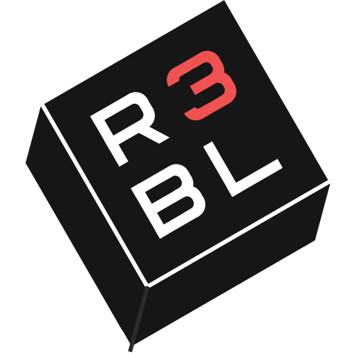

# R3BL VSCode Extensions

A monorepo containing all R3BL VSCode extensions.

## Extensions

### R3BL Theme



A custom VSCode theme designed for Rust and Markdown with R3BL styling. Features a carefully crafted dark theme optimized for code readability and visual appeal.

**Usage:**
- Go to `File > Preferences > Color Theme` (or `Ctrl+K Ctrl+T`)
- Select "R3BL Theme" from the list

### R3BL Auto Insert Copyright


Automatically includes copyright and license headers in your source code files. This extension saves time and cognitive energy by automating the process of adding copyright notices to new files.

**Features:**
- Automatically adds copyright notices to new files upon opening
- Supports multiple license types (MIT, Apache 2.0, GPL 3.0, or custom)
- Manual command available: `Prepend Copyright`
- Configurable for specific file types
- Works right out of the box with sensible defaults

**Supported Languages:**
C, C++, C#, CSS, Go, Java, JavaScript, Objective-C, Rust, SCSS, Swift, TypeScript, TypeScript React, Vue

**Configuration:**
- `copyrighter.author`: Set the copyright holder name
- `copyrighter.license`: Choose license type (none, Apache2, MIT, GPL3)
- `copyrighter.note`: Optional additional note
- `copyrighter.newFilesOnly`: Only inject copyright in new files

Example VSCode settings:
```json
{
  "copyrighter.author": "Your Name",
  "copyrighter.license": "MIT"
}
```

## Installation

### Using Prebuilt Extensions (Recommended)

Fast installation using prebuilt .vsix files:

1. **Clone the repository:**
   ```bash
   git clone https://github.com/r3bl-org/r3bl-vscode-extensions.git
   cd r3bl-vscode-extensions
   ```

2. **Install the prebuilt .vsix files:**
   ```bash
   # For VSCode users
   # Install R3BL Theme
   code --install-extension r3bl-theme-1.0.0.vsix
   # Install R3BL Auto Insert Copyright
   code --install-extension r3bl-auto-insert-copyright-1.0.0.vsix
   
   # For VSCode Insiders users
   # Install R3BL Theme
   code-insiders --install-extension r3bl-theme-1.0.0.vsix
   # Install R3BL Auto Insert Copyright
   code-insiders --install-extension r3bl-auto-insert-copyright-1.0.0.vsix
   ```

3. **Restart VSCode** and enjoy your new extensions!

### Build and Install

If you want to build the extensions from source:

1. **Clone the repository:**
   ```bash
   git clone https://github.com/r3bl-org/r3bl-vscode-extensions.git
   cd r3bl-vscode-extensions
   ```

2. **Run the install script:**
   ```bash
   ./install.sh
   ```

   This script will:
   - Install all dependencies
   - Build and package both extensions
   - Install them in VSCode and VSCode Insiders (if available)

3. **Restart VSCode** and enjoy your new extensions!

### Manual Installation

If you prefer to install manually or need to install specific extensions:

1. **Prerequisites:**
   ```bash
   # Install vsce globally if not already installed
   npm install -g @vscode/vsce
   ```

2. **Clone and setup:**
   ```bash
   git clone https://github.com/r3bl-org/r3bl-vscode-extensions.git
   cd r3bl-vscode-extensions
   npm install
   ```

3. **Build and install specific extensions:**
   ```bash
   # For R3BL Theme
   cd packages/r3bl-theme
   vsce package --no-dependencies
   code --install-extension r3bl-theme-1.0.0.vsix
   
   # For R3BL Auto Insert Copyright
   cd ../r3bl-auto-insert-copyright
   npm run compile
   vsce package --no-dependencies
   code --install-extension r3bl-auto-insert-copyright-1.0.0.vsix
   ```

## Development

### Setup
```bash
npm install
```

### Building
```bash
# Build all extensions
npm run build

# Build specific extension
npm run build:theme
npm run build:copyright
```

### Packaging
```bash
# Package all extensions
npm run package

# Package specific extension
npm run package:theme
npm run package:copyright
```

### Testing
```bash
npm run test
```

### Linting
```bash
npm run lint
```

## Structure

```
packages/
├── r3bl-theme/              # Theme extension
└── r3bl-auto-insert-copyright/ # Copyright insertion extension
```

Each extension maintains its own package.json and can be developed independently while sharing common tooling and configuration.

## Publishing

Each extension can be published individually to the VSCode marketplace using their respective package.json configurations.

## License

MIT - See individual extension LICENSE files for details.
