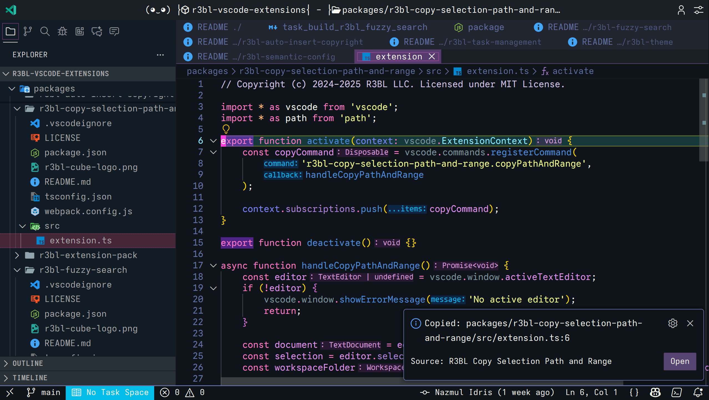
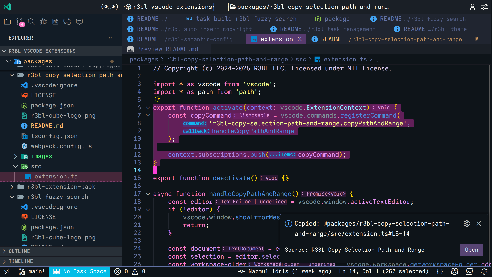

# R3BL Copy Selection Path and Range

Quickly copy file paths with selected line ranges in formats optimized for Claude Code and IDE navigation. Perfect for sharing code references in prompts, documentation, or team communication.

## Features

- **Claude Code Format**: Multi-line selections use `@path#L<start>-<end>` format
- **IDE Format**: Single-line selections use `path:<line>` format for IDE compatibility
- **Keyboard Shortcut**: Quick access with `Alt+O`
- **Relative Paths**: Automatically uses workspace-relative paths
- **Open Button**: Click to navigate back to the copied location
- **Cross-Platform**: Normalizes path separators for consistency

## Screenshots


*Single-line selection copies in IDE-compatible format: `path:line`*


*Multi-line selection copies in Claude Code format: `@path#Lstart-end`*

## Output Formats

The extension automatically chooses the best format based on your selection:

### Multi-Line Selection (Claude Code Format)

When you select multiple lines, the output includes an `@` prefix for Claude Code:

```
@packages/r3bl-copy-selection-path-and-range/src/extension.ts#L6-14
```

This format is optimized for use in Claude Code prompts where the `@` symbol tells Claude to reference that specific file and line range.

### Single-Line Selection (IDE Format)

When you have a single line selected or cursor on a line:

```
packages/r3bl-copy-selection-path-and-range/src/extension.ts:6
```

This format is compatible with most IDEs and terminals that support `file:line` navigation.

## Requirements

- VS Code 1.95.0 or higher
- File must be in an open workspace

## Usage

### Keyboard Shortcut (Recommended)

1. Select lines in your editor (or just place cursor on a line)
2. Press `Alt+O`
3. Path with line range is copied to clipboard
4. Optional: Click "Open" in notification to navigate back

### Command Palette

1. Select lines in your editor
2. Open Command Palette (`Ctrl+Shift+P` or `Cmd+Shift+P`)
3. Type "Copy File Path with Selection Range"
4. Press Enter

## Use Cases

### Claude Code Prompts

Share specific code sections in your prompts:

```
Can you review the error handling in @src/services/api.ts#L45-67?
```

Claude Code will automatically reference that exact section of your code.

### Code Reviews

Share precise locations with team members:

```
Please check the logic in src/utils/parser.ts:123
```

### Documentation

Reference specific implementations in your docs:

```
See the authentication flow in @src/auth/oauth.ts#L15-42
```

### Issue Tracking

Link to exact code locations in bug reports:

```
The bug occurs in src/components/Form.tsx:89
```

## Commands

- **`R3BL: Copy File Path with Selection Range`** - Copy the current file path with selection range to clipboard

## Keyboard Shortcuts

| Shortcut | Command ID | When |
|----------|------------|------|
| `Alt+O` | `r3bl-copy-selection-path-and-range.copyPathAndRange` | Editor has focus |

You can customize this shortcut in VS Code's Keyboard Shortcuts settings by searching for the command ID above.

## How It Works

1. **Path Calculation**: Gets relative path from workspace root
2. **Line Detection**: Determines if selection spans multiple lines
3. **Format Selection**:
   - Multi-line → Claude Code format with `@` prefix
   - Single-line → IDE format
4. **Clipboard**: Copies formatted string
5. **Notification**: Shows confirmation with "Open" button

## Release Notes

See [CHANGELOG.md](../../CHANGELOG.md) for detailed release notes and version history.

## License

MIT

## Contributing

Found a bug or have a feature suggestion? Please open an issue at:
https://github.com/r3bl-org/r3bl-vscode-extensions/issues

---

**Copy and share context with Claude Code effortlessly!**
