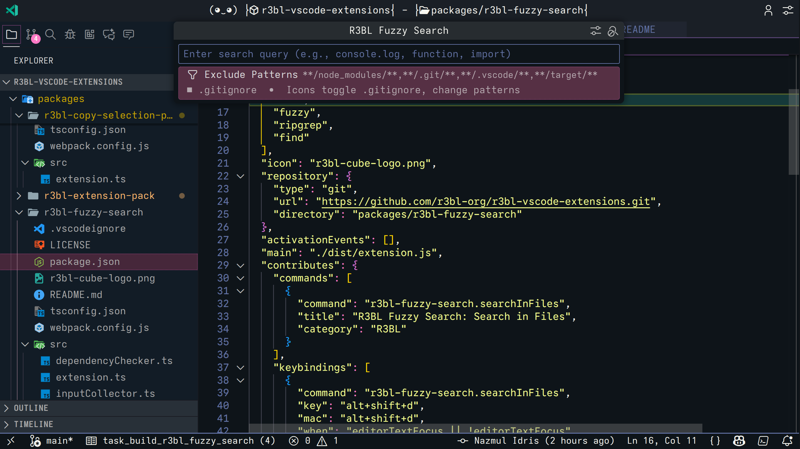
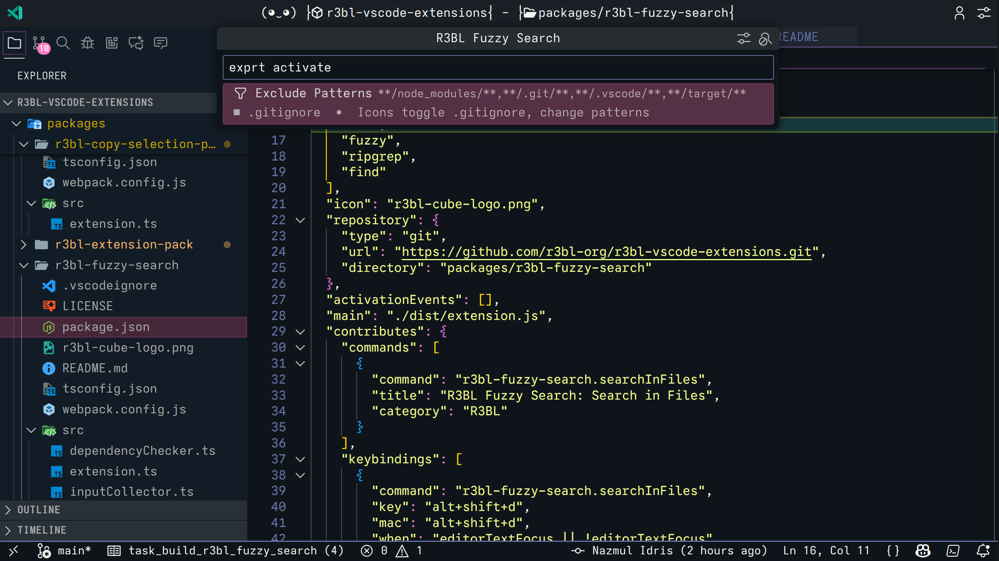
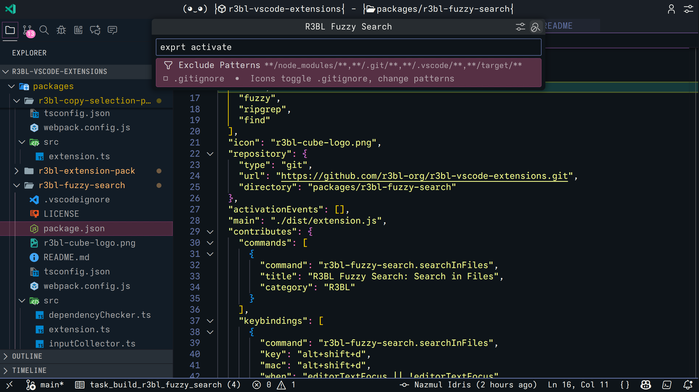
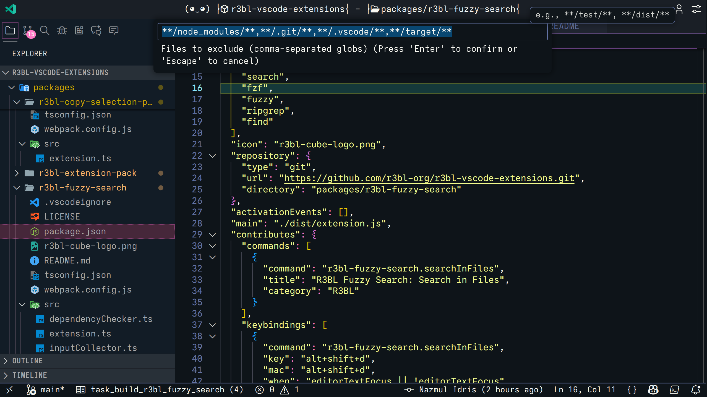
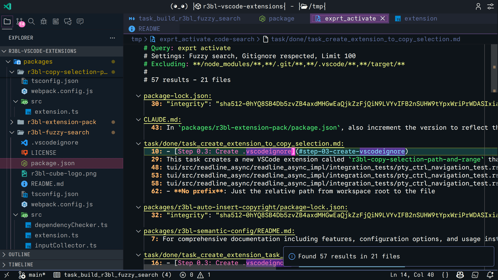

# R3BL Fuzzy Search

Fuzzy search across file contents using fzf, displaying results in VS Code's Search Editor format.

## Features

- **Fuzzy Search**: Smart search using [fzf](https://github.com/junegunn/fzf) that tolerates typos
- **Fast Results**: Powered by [ripgrep](https://github.com/BurntSushi/ripgrep) for lightning-fast file content search
- **Search Editor Format**: Results displayed in VS Code's native Search Editor with clickable navigation
- **Customizable Excludes**: Configure which files and directories to exclude from search
- **Gitignore Support**: Automatically respects `.gitignore` files, with toggle to enable/disable
- **Result Limit**: Configurable maximum number of results (default: 100)
- **Saved Results**: Search results automatically saved to `/tmp/` for easy access

## Screenshots

*QuickPick interface with search query input and settings display*

*Toggle .gitignore respect on/off with icon button*

*Results displayed in Search Editor format with clickable line numbers*

*Configure exclude patterns with the gear icon*

*Complete settings view showing all configuration options*

## Requirements

This extension requires the following command-line tools to be installed:

- **ripgrep (rg)**: Fast file content search
  - macOS: `brew install ripgrep`
  - Linux: `sudo apt install ripgrep` (Debian/Ubuntu) or `sudo dnf install ripgrep` (Fedora)
  - More: https://github.com/BurntSushi/ripgrep#installation

- **fzf**: Fuzzy finder
  - macOS: `brew install fzf`
  - Linux: `sudo apt install fzf` (Debian/Ubuntu) or `sudo dnf install fzf` (Fedora)
  - More: https://github.com/junegunn/fzf#installation

**Platform Support**: macOS and Linux only (Windows is not supported)

## Usage

### Keyboard Shortcut

Press `Alt+Shift+D` to start a fuzzy search (same shortcut for both macOS and Linux).

### Search Workflow

1. **Enter search query**: Type your fuzzy search pattern (e.g., `exprt` will find `export`)
2. **Toggle settings** (optional): Use icon buttons to toggle .gitignore respect or modify exclude patterns
   - Click gear icon (⚙️) to modify exclude patterns
   - Click search-stop icon (🔍) to toggle .gitignore respect
3. **View results**: Results open in a Search Editor with clickable line numbers for easy navigation
4. **Access saved results**: Results are automatically saved to `/tmp/` with query-based filename

### Example

Search for `exprt activate` (with a typo):
- Finds: `export function activate`, `export const activate`, etc.
- Results grouped by file
- Click any result to jump to that location
- Saved to: `/tmp/exprt_activate.code-search`

## Extension Settings

This extension contributes the following settings:

- `r3blFuzzySearch.fzfPath`: Path to fzf executable (default: `fzf`)
- `r3blFuzzySearch.ripgrepPath`: Path to ripgrep executable (default: `rg`)
- `r3blFuzzySearch.defaultExcludePattern`: Default comma-separated glob patterns for files to exclude (default: `**/node_modules/**,**/.git/**,**/.vscode/**,**/target/**`)
- `r3blFuzzySearch.resultLimit`: Maximum number of search results to display (default: 100, range: 1-10000)
- `r3blFuzzySearch.respectGitignore`: Automatically respect .gitignore files when searching (default: true)

## Commands

- `R3BL Fuzzy Search: Search in Files` - Start a fuzzy search in the current workspace

## Advantages Over Built-in Search

| Feature | Built-in Search | R3BL Fuzzy Search |
|---------|----------------|-------------------|
| Matching | Exact/Regex | Fuzzy (FZF) |
| Typo Tolerance | No | Yes |
| Speed | Fast | Fast (rg+fzf) |
| Result Display | Sidebar or Editor | Search Editor |
| Keybinding | `Ctrl+Shift+F` | `Alt+Shift+D` |
| Gitignore | Always respected | Toggleable |

## Known Issues

- Results are limited to the configured maximum (default 100). If you hit this limit, consider narrowing your search query.
- Windows is not supported due to simplified path handling for Unix-like systems.

## Release Notes

### 1.0.0

Initial release of R3BL Fuzzy Search:
- Fuzzy search using fzf
- Integration with ripgrep for fast content search
- Search Editor results display
- Configurable exclude patterns and result limits
- Gitignore support with toggle on/off
- Results automatically saved to `/tmp/`
- Custom keybinding: `Alt+Shift+D`
- macOS and Linux support

## License

MIT

## Contributing

Found a bug or have a feature request? Please open an issue at:
https://github.com/r3bl-org/r3bl-vscode-extensions/issues

---

**Enjoy fuzzy searching!**
