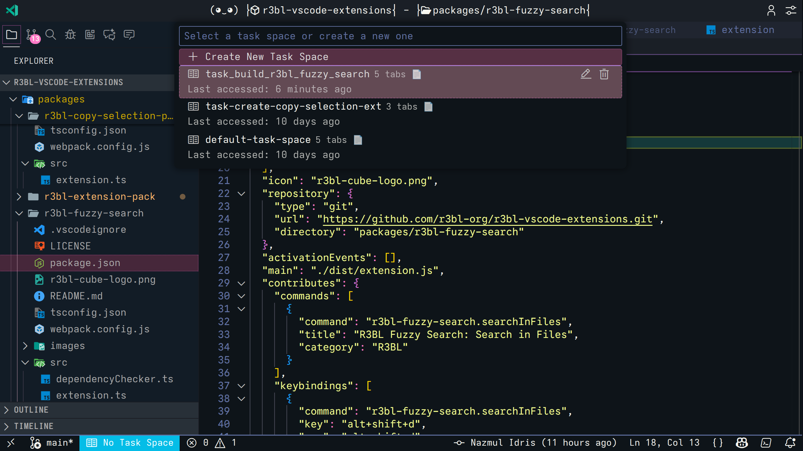
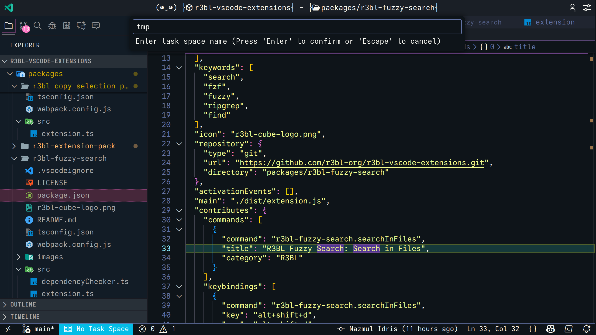
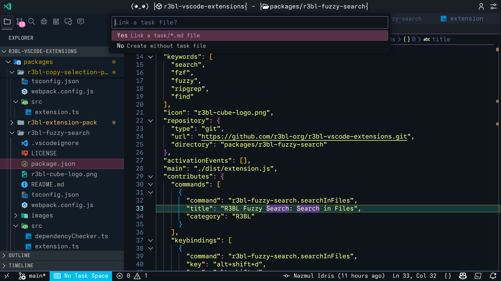
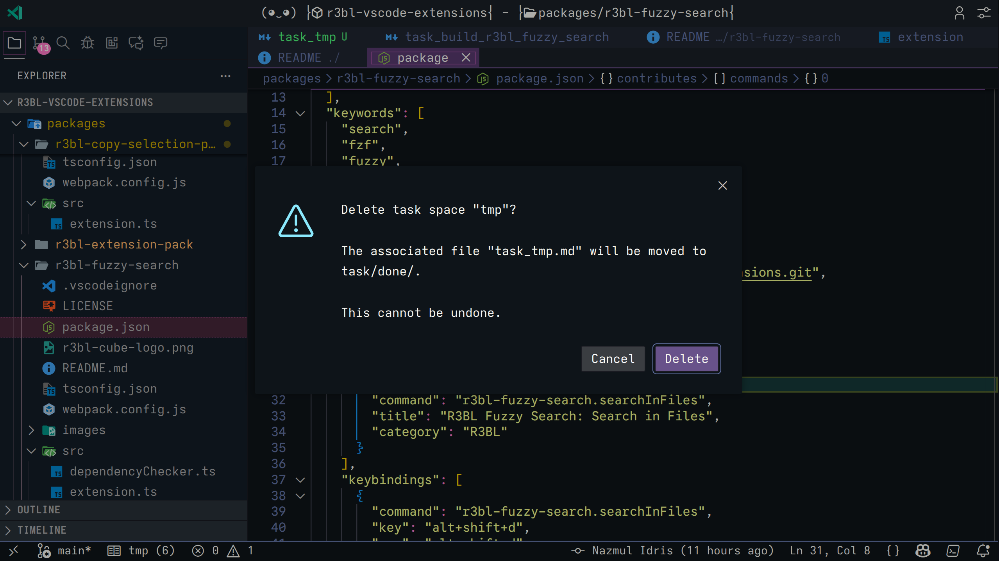
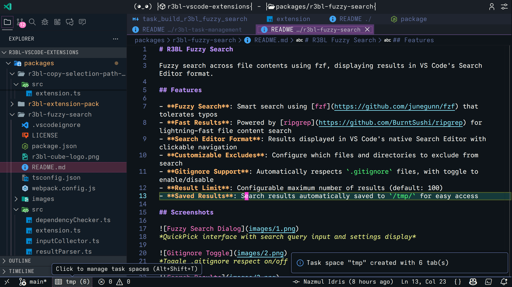

# R3BL Task Management

Manage task spaces - collections of open tabs for different work contexts. Inspired by IntelliJ IDEA's Task Management plugin, this extension adds powerful features for working with Claude Code: track design and implementation docs in `task/*.md` files, then automatically archive them to `task/done/` when work is complete. See [Basic Workflow](#basic-workflow) and [Claude Code Workflow](#task-file-integration--claude-code-workflow).

## Features

- **Task Spaces**: Organize your work into distinct task spaces, each with its own set of open tabs
- **Quick Switching**: Instantly switch between task spaces with keyboard shortcut (Alt+Shift+T)
- **Claude Code Integration**: Link task spaces to markdown files in your `task/` directory to track design docs, implementation plans, and instructions for Claude Code
- **Automatic Archival**: When you close a task space, the linked file is automatically moved to `task/done/`, keeping your workspace organized
- **Status Bar**: See your active task space and tab count at a glance
- **Auto-Save**: Automatically saves your current tabs when switching task spaces
- **Smart Collision Handling**: Prevents data loss by adding numeric suffixes when moving files with duplicate names
- **Workspace Persistence**: Task spaces are saved in `.vscode/task-spaces.json` per workspace

## Screenshots


*Main dialog showing all your task spaces with tab counts and last accessed times*


*Enter a name for your new task space*


*Optionally link a markdown file from your task/ directory*


*When you're done with a task, you can delete it. Delete confirmation shows that the linked file will be moved to task/done/*


*Status bar showing active task space with name and tab count*

## Requirements

- VS Code 1.70.0 or higher
- No external dependencies required

## Usage

### Keyboard Shortcut

Press **Alt+Shift+T** to open the Task Spaces dialog (works on all platforms).

### Basic Workflow

1. **Create a task space**:
   - Press `Alt+Shift+T`
   - Click "Create New Task Space"
   - Enter a name (e.g., "Feature: User Authentication")
   - Optionally link a task file from your `task/` directory
   - The task space captures all currently open tabs

2. **Switch between task spaces**:
   - Press `Alt+Shift+T`
   - Select a task space from the list
   - All current tabs will close
   - Tabs from the selected task space will open
   - Your previous task space is automatically saved

3. **Manage task spaces**:
   - **Rename**: Click the edit icon (✏️) next to a task space
   - **Delete**: Click the delete icon (🗑️) next to a task space
   - Deleting a task space with a linked file automatically moves it to `task/done/`

### Task File Integration & Claude Code Workflow

Task spaces can be linked to markdown files in your `task/` directory. This creates a powerful workflow for working with Claude Code:

**Planning Phase** (`task/` directory):
- Create a detailed design and implementation doc in `task/task_feature_name.md`
- Include specifications, requirements, and step-by-step plans
- Give this plan to Claude Code to work on
- Create a task space linked to this file to organize all related tabs

**Implementation Phase**:
- Work on the feature with Claude Code
- Keep the task file updated with progress and notes
- All relevant files stay organized in your task space

**Completion Phase** (`task/done/` directory):
- When work is complete, delete the task space
- The linked file is **automatically moved** from `task/` to `task/done/`
- If a file with the same name exists in `task/done/`, a numeric suffix is added (e.g., `task_foo_2.md`)
- This keeps your workspace organized and creates an archive of completed work

This workflow is inspired by IntelliJ IDEA's Task Management plugin but enhanced specifically for Claude Code collaboration and markdown-based planning.

### Status Bar

The status bar (bottom-left) shows your current task space:
- **Active task space**: Shows task space name and tab count
- **No task space**: Shows "No Task Space" with warning background

Click the status bar item to open the Task Spaces dialog.

## Extension Settings

This extension contributes the following settings:

- `r3bl-task-management.autoSaveCurrentTaskSpace`: Automatically save the current task space when tabs change (default: `true`)
- `r3bl-task-management.confirmBeforeSwitch`: Show confirmation dialog before switching task spaces (default: `false`)
- `r3bl-task-management.showStatusBar`: Show current task space in status bar (default: `true`)

## Commands

- `R3BL Task Management: Manage Task Spaces` - Open the task spaces management dialog

## Use Cases

### Multi-Feature Development
Working on multiple features simultaneously? Create a task space for each feature with all relevant files open.

### Context Switching
Need to switch from feature development to bug fixing? Save your current work in a task space and switch to your bug-fixing task space.

### Code Review
Create a task space for reviewing pull requests with all the changed files open.

### Research vs Implementation
Keep your research tabs (documentation, Stack Overflow) separate from your implementation tabs.

## File Storage

Task spaces are stored in `.vscode/task-spaces.json` in your workspace root:

```json
{
  "version": "1.0",
  "taskSpaces": [
    {
      "name": "Feature: Authentication",
      "id": "uuid",
      "tabs": ["src/auth.ts", "src/login.ts"],
      "taskFile": "task/task_authentication.md",
      "activeTab": "src/auth.ts",
      "createdAt": 1234567890,
      "lastAccessed": 1234567890
    }
  ],
  "activeTaskSpaceId": "uuid"
}
```

This file is workspace-specific, so different projects maintain separate task spaces.

## Release Notes

See [CHANGELOG.md](../../CHANGELOG.md) for detailed release notes and version history.

## License

MIT

## Contributing

Found a bug or have a feature request? Please open an issue at:
https://github.com/r3bl-org/r3bl-vscode-extensions/issues

---

**Stay organized and productive!**
