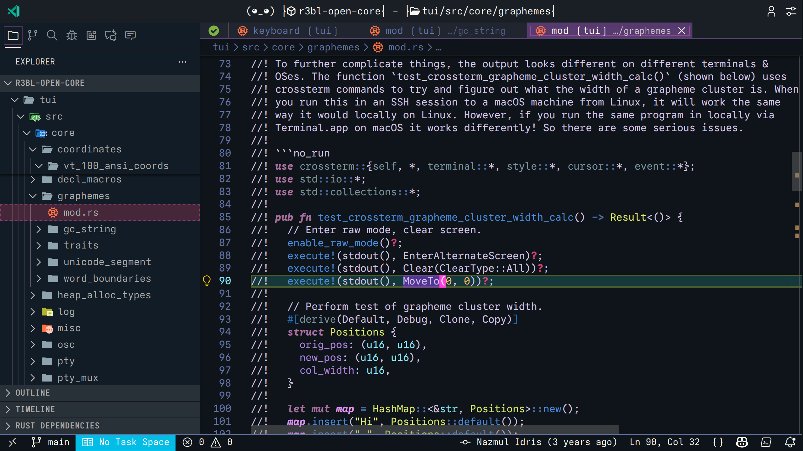
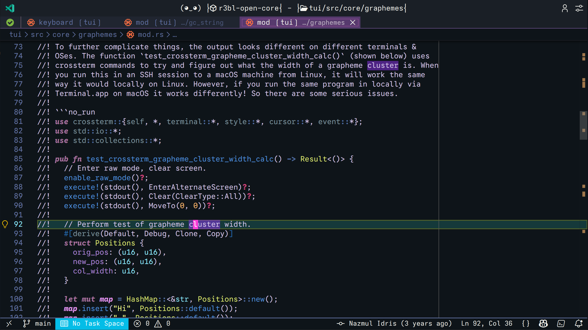
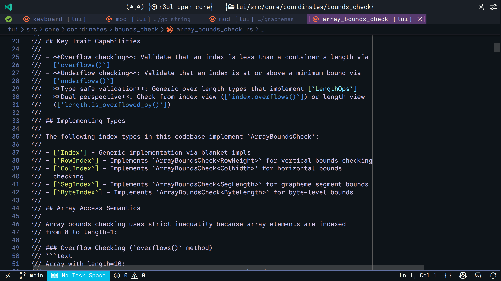
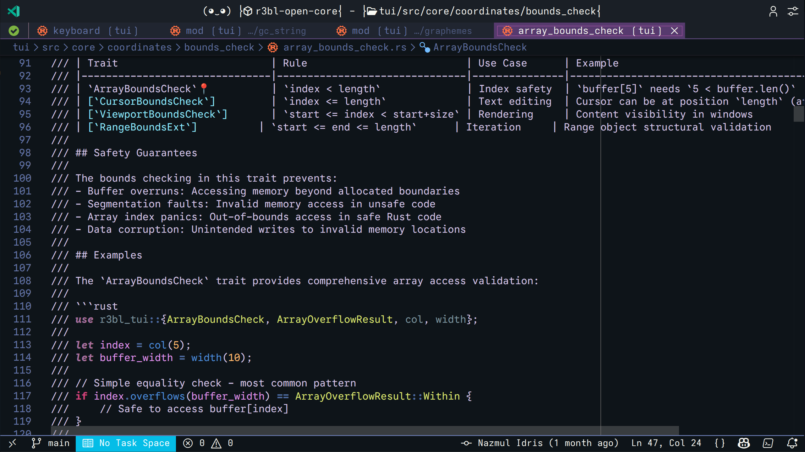
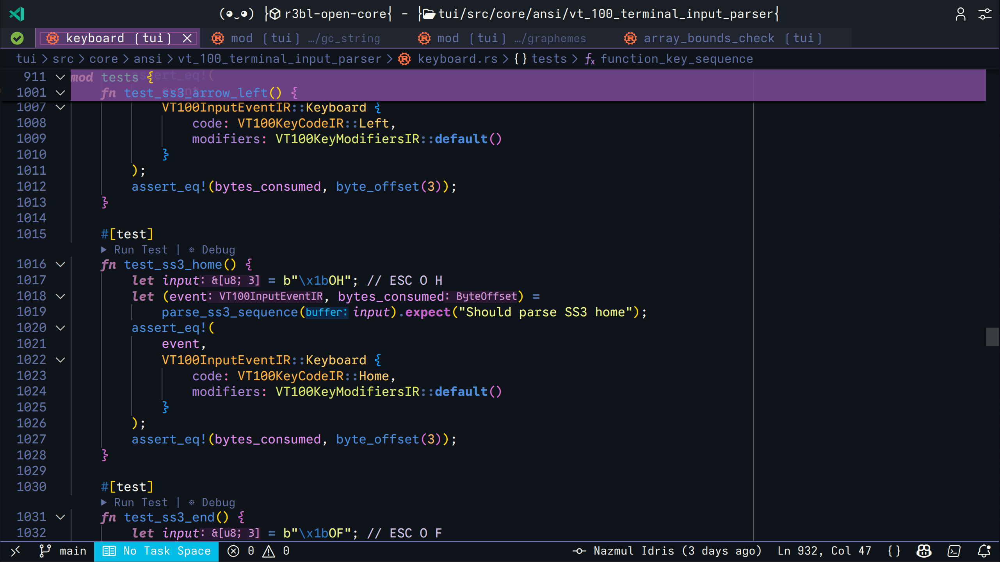
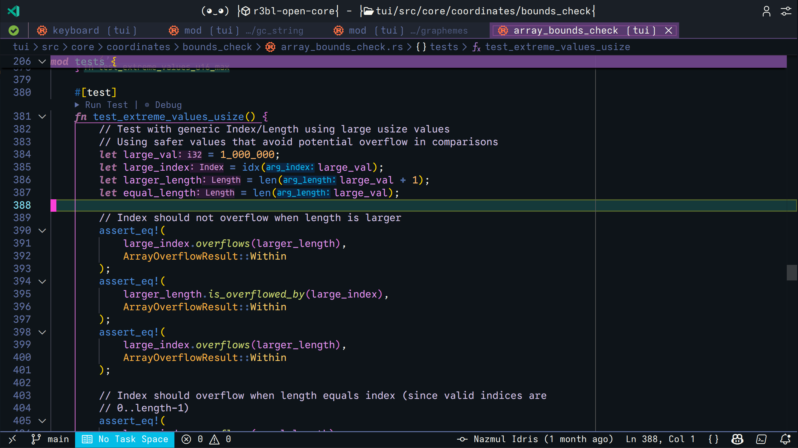
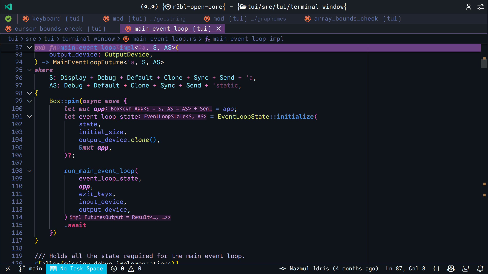
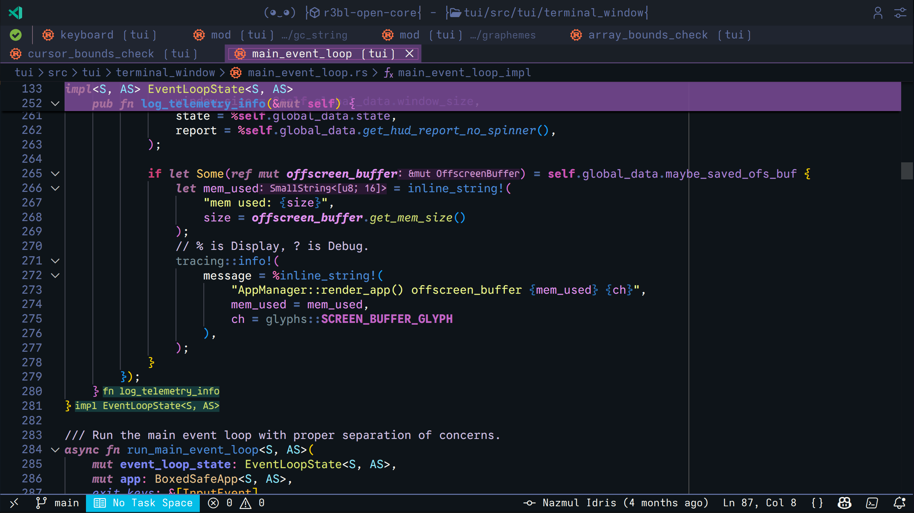
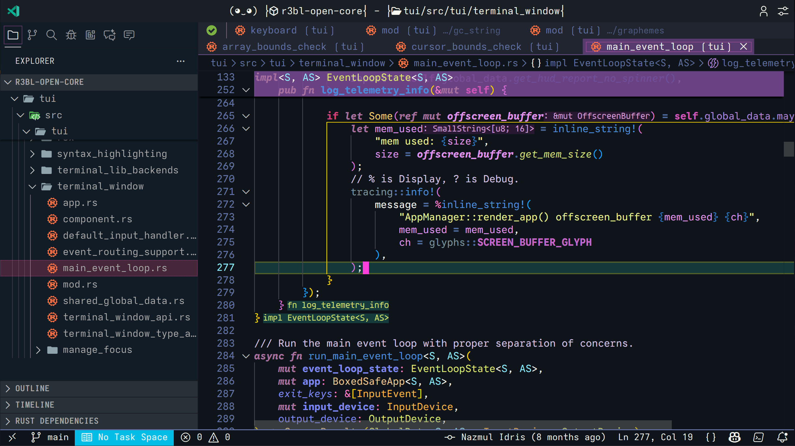

# R3BL Theme

A carefully crafted dark theme for VS Code, optimized for Rust and Markdown development with enhanced readability and visual appeal.

## Features

- **Rust-Optimized Colors**: Specially designed syntax highlighting for Rust code with distinct colors for keywords, types, functions, and macros
- **Dark Theme Excellence**: Professional dark color scheme that reduces eye strain during long coding sessions
- **Enhanced Test Visibility**: Test functions highlighted in purple for easy identification
- **Rich Markdown Support**: Beautiful rendering of documentation comments and markdown tables
- **Semantic Highlighting**: Automatically installs [R3BL Semantic Configuration](https://marketplace.visualstudio.com/items?itemName=R3BL.r3bl-semantic-config) for enhanced Rust highlighting
- **Consistent UI**: Carefully selected colors for sidebar, tabs, status bar, and terminals
- **Bracket Pair Colorization**: Clear visual distinction for nested code blocks
- **Selection & Search**: High-contrast selection and search highlighting

## Screenshots


*Full editor view with sidebar, tabs, and Rust code highlighting*


*Rust-specific syntax highlighting with distinct keyword, type, and function colors*


*Beautiful rendering of documentation comments with code examples*


*Markdown-style tables in comments with clear formatting*


*Test functions highlighted in purple for easy identification*


*Clear variable and parameter highlighting in test code*


*Async function highlighting with type parameters and trait bounds*


*Complex type annotations with clear visual hierarchy*


*Selection highlighting with bracket pair colorization*

## Installation

### From Extension Pack (Recommended)

Install the [R3BL Extension Pack](https://marketplace.visualstudio.com/items?itemName=R3BL.r3bl-extension-pack) which includes this theme along with other R3BL tools.

### Standalone Installation

1. Open VS Code
2. Press `Ctrl+P` (or `Cmd+P` on macOS)
3. Type: `ext install R3BL.r3bl-theme`
4. Press Enter

### From VSIX File

```bash
code --install-extension r3bl-theme-x.x.x.vsix
```

## Usage

### Activate the Theme

1. Open Command Palette (`Ctrl+Shift+P` or `Cmd+Shift+P`)
2. Type "Color Theme"
3. Select "Preferences: Color Theme"
4. Choose "R3BL Theme"

**Or use the keyboard shortcut:**
- Press `Ctrl+K Ctrl+T` (or `Cmd+K Cmd+T` on macOS)
- Select "R3BL Theme"

### Enhanced Semantic Highlighting

This theme **automatically installs** the R3BL Semantic Configuration extension, which provides enhanced semantic highlighting specifically designed to complement this theme's color palette.

The semantic configuration extension:
- Automatically detects when R3BL Theme is active
- Applies optimized semantic highlighting for Rust (functions, methods, structs, enums, etc.)
- Can be enabled/disabled via commands: `R3BL: Enable/Disable Semantic Highlighting`

**No additional setup required** - just activate the R3BL Theme and enjoy enhanced syntax highlighting!

### Color Palette

The theme uses a carefully selected color palette:

| Element | Color | Usage |
|---------|-------|-------|
| **Keywords** | Purple (`#c586c0`) | `fn`, `let`, `mut`, `pub`, etc. |
| **Types** | Teal (`#4ec9b0`) | Struct names, type parameters |
| **Functions** | Yellow (`#dcdcaa`) | Function names and calls |
| **Strings** | Orange (`#ce9178`) | String literals |
| **Numbers** | Green (`#b5cea8`) | Numeric literals |
| **Comments** | Gray (`#6a9955`) | Single and multi-line comments |
| **Macros** | Cyan (`#4fc1ff`) | Rust macros like `println!` |
| **Test Functions** | Purple (background) | Test function highlighting |

### Recommended Settings

For the best experience with this theme:

```json
{
  "editor.semanticHighlighting.enabled": true,
  "editor.bracketPairColorization.enabled": true,
  "editor.guides.bracketPairs": "active",
  "workbench.colorTheme": "R3BL Theme"
}
```

## Optimized For

### Primary Languages
- **Rust** - Enhanced syntax highlighting for keywords, types, macros, and test functions
- **Markdown** - Beautiful rendering of documentation and README files

### Also Works Great With
- TypeScript/JavaScript
- Python
- Go
- JSON/YAML
- Shell scripts
- And more!

## What Makes It Different

### Rust-First Design
Unlike generic themes, R3BL Theme is built specifically for Rust developers:
- Distinct colors for `pub`, `fn`, `impl`, `trait`, and other Rust keywords
- Clear visual distinction between owned types, references, and lifetimes
- Macro highlighting that stands out
- Test function backgrounds for easy test identification

### Semantic Awareness
Works with VS Code's semantic highlighting to provide context-aware colors based on the language server's understanding of your code, not just regex patterns.

### Eye Comfort
- Carefully calibrated contrast ratios
- No harsh whites or overly bright colors
- Consistent darkness across all UI elements
- Reduced blue light in the color palette

## Comparison with Other Themes

| Feature | R3BL Theme | Generic Dark Themes |
|---------|-----------|---------------------|
| Rust Optimization | ✅ Purpose-built | ❌ Generic patterns |
| Test Highlighting | ✅ Purple backgrounds | ❌ No distinction |
| Semantic Support | ✅ Full support | ⚠️ Varies |
| Markdown in Comments | ✅ Rendered | ⚠️ Basic |
| Eye Comfort | ✅ Optimized | ⚠️ Varies |

## Customization

Want to tweak the theme? Add to your `settings.json`:

```json
{
  "workbench.colorCustomizations": {
    "[R3BL Theme]": {
      "editor.background": "#1e1e1e",
      "editor.foreground": "#d4d4d4"
    }
  },
  "editor.tokenColorCustomizations": {
    "[R3BL Theme]": {
      "textMateRules": [
        {
          "scope": "keyword.control.rust",
          "settings": {
            "foreground": "#YOUR_COLOR"
          }
        }
      ]
    }
  }
}
```

## Release Notes

See [CHANGELOG.md](../../CHANGELOG.md) for detailed release notes and version history.

## License

MIT

## Contributing

Found a color that doesn't look quite right? Have a suggestion for improvement? Please open an issue at:
https://github.com/r3bl-org/r3bl-vscode-extensions/issues

---

**Code in color, code in style!**
